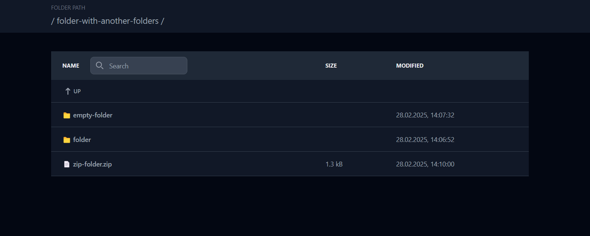

# Folder storage 

   

Welcome to the web **file storage** project. 

<p align="center">
  
</p>

The key goal is to display the information repository in web format. Essentially, the backend of the application accesses files located in local storage and makes them available through output to the frontend in the browser. Also, some additional features are implemented to simplify navigation in files.

## Content

- [Features](#features)
- [Installation](#installation)
- [Used technologies](#installation)

## Features

- **List of files** 
    The app displays a list of various files and folders in a list format. The list also contains information about the last modification and size of the files.

- **Breadcrumbs**
    A convenient navigation function has been implemented, allowing you to quickly move between repositories. When you go to any directory except the root directory, the button to return to the parent directory also becomes available.

- **Search input**
    A search system is enabled that provides filtering of files located in the current directory.

- **Download option**
    Downloading is possible for text files, images, zip folders, etc. You can do this by clicking on the name.

## Installation

### Changing the working repository

To use file storage for your purposes, please remember to put your files inside the **data** folder inside the root project

### Launching the application

1. To run the project, you need to install node.js. You can do this on the [official website](https://nodejs.org/en/).Recommended version LTS. 
After downloading, install via the regular installer.

2. In the terminal check the node version

    ```bash
    node --version
    ```
    And also the version of the npm package manager

    ```bash
    npm --version
    ```

    If the versions are displayed correctly, then the installation was successful.

3. Download this project to your own machine or clone using the web URL

    ```bash
    git clone https://github.com/Okarine/folder-storage.git
    ```

4. Before directly launching the project, you need to go to the root folder of the project and install the libraries used with the command

    ```bash
    npm i
    ```

    The root folder of the project will contain a node_modules folder with libraries and a configuration file package-lock.json

5. And launch the project with the command

    ```bash
    npm start
    ```

## Used technologies 

-*backend:* [Node.js](https://nodejs.org/en), [Express](https://expressjs.com/) web framework
-*frontend:* Javascript, [TailwindCSS](https://tailwindcss.com/)